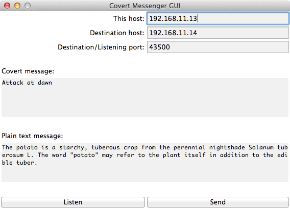

Covert-Messenger
================
This application sends encoded messages between networked computers.  The goal is to hide the fact that an encoded message is being sent, so casual analysis of the data packets should reveal no suspicious behavior.

Requirements
============
This application requires Python 3 to run.

Usage
=====

Receiver
--------
1. Run:
`python src/covert_gui.py`

2. Type in a port between 1024 and 65535.

3. Click the "Listen" button.

Sender
------
1. Run:
`sudo python src/covert_gui.py`

2. Type in the same port used by the receiver.

3. Type in a covert message.  Allowed characters are:  letters, numbers, space, period, question mark.

4. Type in a plain text message that will be viewable on the wire (e.g. using Wireshark).

5. Click the "Send" button.

Known Issues
============

1. The sender currently needs to run the application with root permissions because there are certain messages that will result in the usage of a privileged port.

2. Plain text message must be longer than the covert message.
